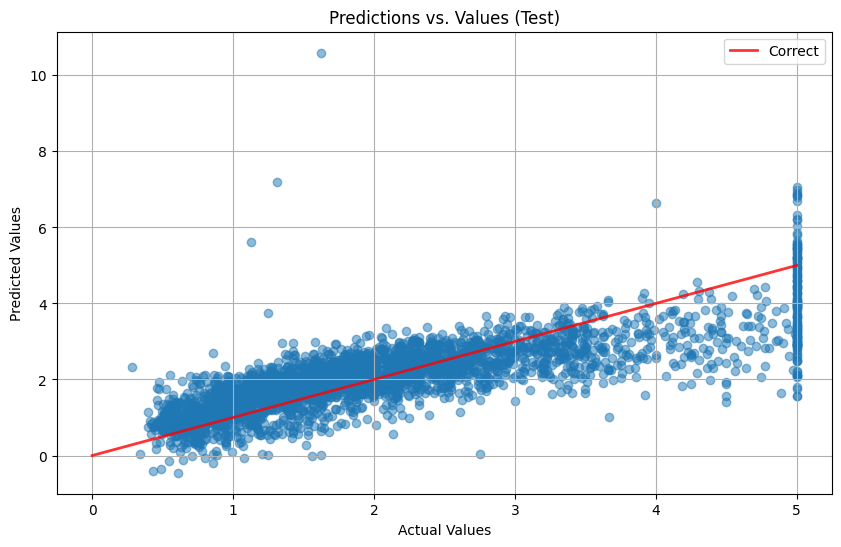

# Linear Regression from scratch
A non-vectorized and vectorized implementation of linear regression using Gradient Descent.

## Aim
The aim of this project is to understand the Gradient Descent algorithm and how it is used to train linear regression models. To do this more effectively, I implement both a non-vectorized and a vectorized version of a linear regression model. In this way, I first have to fully write out each small computational step with pure Python and then turn the code into a vectorized version using Numpy, which is crucial for efficiency improvements.

This fits into my broader learning approach for the field of Machine Learning, which is to:
1. Build several models completely from scratch to deeply understand the theory and math underlying them
2. Build on that knowledge by creating more complex projects where the focus shifts from raw implementation and theory to practical results for real-world problems.

This project is particularly relevant as my next project will be implementing an Artificial Neural Network (ANN) from scratch, where the Gradient Descent algorithm is also relevant.

## Features
- Non-vectorized version of linear regression with Gradient Descent using only standard Python
- Vectorized version of linear regression with Gradient Descent using only Python and Numpy
- Adjustable batch size for stochastic, mini-batch and batch GD

## How It Works
The model's weights are initialized by uniformly sampling between -1 and 1. During training the model first creates the appropriate number of batches out of the training data, given the batch size. Then it goes through all training examples in each batch and accumulates the gradients for them before updating it's weights and bias with the average of the accumulated gradients.

## Google Colab
You can run this project using Google Colab instead of your local machine: 

[](https://colab.research.google.com/github/AntonNiko06/Linear-Regression/blob/main/simple_lr.ipynb)

## Local Installation
1. **Clone the repository**
```bash
git clone https://github.com/AntonNiko06/Linear-Regression.git
cd Linear-Regression
```
2. **Create virutal environment** (Optional)
```bash
python -m venv venv
```
```bash
source venv/bin/activate # On macOS/Linux
venv\Scripts\activate # On Windows
```
or
```bash
cd venv//Scripts
. activate
cd ..//..
```
3. **Install dependencies**
```bash
pip install -r requirements.txt
```

### Usage
Now you can simply execute the following command to run the script version of the project:
```bash
python simple_lr.py
```

## Results / Output
Training loss over epochs

Predictions vs actual values


## Possible Improvements
[[ What could be done to improve performance? Speed up training? Etc. ]]
